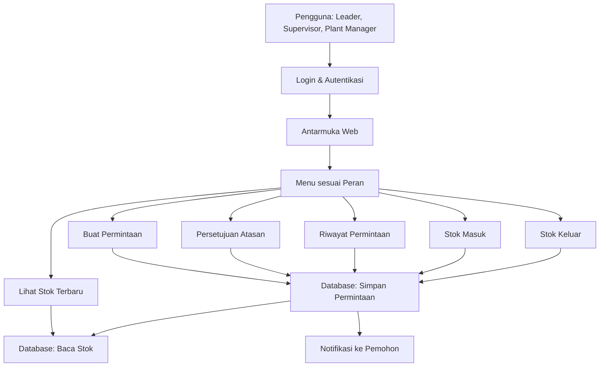
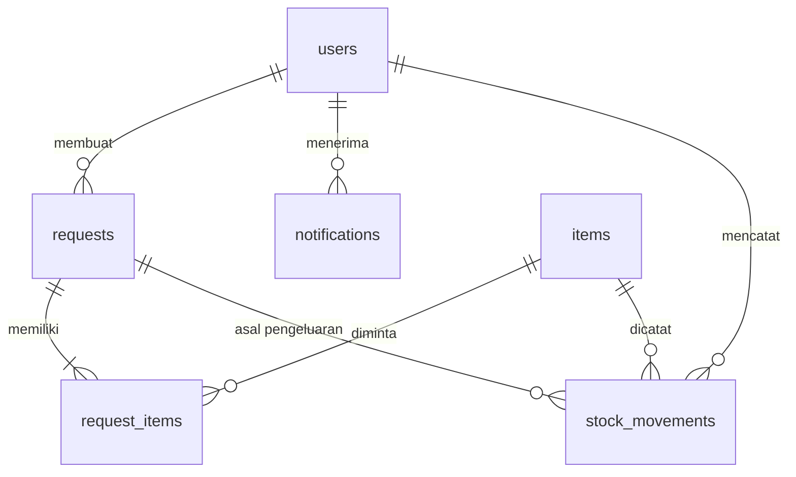

# PRD — Project Requirements Document

## 1. Overview

Masalah yang ingin diselesaikan adalah administrasi permintaan barang kebutuhan produksi yang masih manual dan tidak tertata. Karyawan (leader) sering kesulitan mengajukan permintaan barang seperti sarung tangan, masker, atau pulpen; atasan (supervisor dan plant manager) kesulitan menyetujui secara cepat; dan stok barang tidak terpantau dengan jelas.

Tujuan utama aplikasi ini adalah menyediakan satu sistem terpadu untuk:

- Membuat permintaan barang secara cepat dan tertib.
- Menyetujui atau menolak permintaan oleh supervisor dan plant manager.
- Memantau riwayat siapa meminta barang apa dan bagaimana statusnya.
- Mencatat stok masuk dan stok keluar agar jumlah stok selalu terbaru dan akurat.
- Memberikan notifikasi hasil keputusan agar semua pihak tahu perkembangan permintaan.

Dengan aplikasi ini, proses permintaan barang menjadi lebih cepat, lebih transparan, dan administrasinya lebih rapi.

## 2. Requirements

- **Peran Pengguna**: Aplikasi harus mendukung tiga peran — Leader, Supervisor, dan Plant Manager — dengan hak akses berbeda.
- **Login & Keamanan**: Setiap pengguna harus masuk dengan akun dan kata sandi. Sesi harus aman dan bisa diakhiri kapan saja.
- **Alur Permintaan**: Leader dapat membuat permintaan, lalu atasan menyetujui atau menolak. Pemohon mendapat notifikasi hasilnya.
- **Manajemen Stok**: Sistem harus mencatat barang masuk dan barang keluar, sehingga stok yang ditampilkan selalu mutakhir.
- **Pencarian & Penyaringan**: Permintaan dan stok harus bisa dicari berdasarkan barang, pemohon, atau tanggal agar mudah ditemukan.
- **Hak Akses**: Supervisor dan Plant Manager melihat antrean permintaan; hanya peran yang berwenang yang bisa menyetujui/menolak; leader hanya bisa membuat permintaan dan melihat statusnya.
- **Riwayat Lengkap**: Semua permintaan dan pergerakan stok tersimpan lengkap sebagai catatan administrasi.
- **Notifikasi**: Sistem memberi tahu pemohon saat permintaan disetujui atau ditolak.

## 3. Core Features

### Fase 1 — Buat Permintaan
- **Pilih Barang** — Leader mencari dan memilih barang yang dibutuhkan dari daftar stok tersedia.
- **Lengkapi Detail** — Mengisi jumlah, keperluan, dan catatan agar permintaan jelas.
- **Kirim Permintaan** — Mengirim permintaan ke atasan untuk langsung diproses.

### Fase 2 — Persetujuan Atasan, Riwayat, dan Stok Terbaru
- **Antrean Permintaan** — Supervisor dan Plant Manager melihat daftar permintaan yang menunggu keputusan.
- **Keputusan Setuju/Tolak** — Menyetujui atau menolak permintaan disertai alasan.
- **Pemberitahuan Hasil** — Pemohon mendapat notifikasi saat permintaan disetujui atau ditolak.
- **Daftar Permintaan** — Menampilkan semua permintaan yang pernah dibuat beserta statusnya.
- **Cari & Saring** — Mencari permintaan berdasarkan nama barang, pemohon, atau tanggal.
- **Ringkasan Stok** — Menampilkan daftar barang dengan jumlah stok terbaru secara ringkas.
- **Cari Barang** — Mencari stok barang tertentu dengan cepat.

### Fase 3 — Stok Masuk dan Stok Keluar
- **Form Barang Masuk** — Mengisi data barang masuk seperti nama, jumlah, dan tanggal.
- **Riwayat Stok Masuk** — Melihat catatan semua barang yang pernah masuk.
- **Catat Barang Keluar** — Mengisi pengeluaran barang, misalnya dari permintaan yang disetujui.
- **Riwayat Stok Keluar** — Melihat catatan semua barang yang pernah keluar.

### Fase 4 — Login & Peran
- **Login** — Masuk dengan akun dan kata sandi sesuai peran.
- **Hak Akses Peran** — Setiap peran hanya melihat menu dan aksi sesuai wewenangnya.
- **Keluar Akun** — Mengakhiri sesi dengan aman.

- **Cetak Permintaan Barang** — Menyediakan tombol cetak/PDF pada detail permintaan agar dapat disimpan atau dicetak sebagai bukti fisik transaksi. Cetakan harus mencantumkan nama Pemohon (Leader) dan nama Penyetuju (Supervisor/Plant Manager) beserta kolom tanda tangan atau label nama yang jelas sebagai bukti pertanggungjawaban.
- **Cetak Stok Masuk** — Menyediakan tombol cetak/PDF pada riwayat stok masuk sebagai bukti fisik transaksi. Cetakan harus mencantumkan nama Petugas yang mencatat stok masuk beserta kolom tanda tangan atau label nama yang jelas sebagai bukti pertanggungjawaban.
- **Cetak Stok Keluar** — Menyediakan tombol cetak/PDF pada riwayat stok keluar sebagai bukti fisik transaksi. Cetakan harus mencantumkan nama Petugas yang mencatat stok keluar beserta kolom tanda tangan atau label nama yang jelas sebagai bukti pertanggungjawaban.

## 4. User Flow

### Alur Leader (Pemohon)
1. Login menggunakan akun leader.
2. Membuka menu "Buat Permintaan".
3. Mencari dan memilih barang yang dibutuhkan.
4. Mengisi jumlah, keperluan, dan catatan.
5. Menekan tombol "Kirim Permintaan".
6. Menunggu keputusan atasan.
7. Menerima notifikasi: permintaan disetujui atau ditolak.
8. Membuka menu "Riwayat Permintaan" untuk melihat status semua permintaannya.

### Alur Supervisor / Plant Manager (Atasan)
1. Login menggunakan akun masing-masing.
2. Membuka menu "Antrean Permintaan".
3. Melihat daftar permintaan yang menunggu keputusan.
4. Memilih satu permintaan untuk diperiksa detailnya.
5. Menekan "Setuju" atau "Tolak" dan mengisi alasan bila perlu.
6. Sistem otomatis memberi notifikasi ke pemohon.
7. Membuka menu "Riwayat Permintaan" untuk memantau semua permintaan yang pernah masuk.

### Alur Pengelola Stok
1. Membuka menu "Stok Masuk" untuk mencatat barang yang datang.
2. Mengisi nama barang, jumlah, dan tanggal, lalu menyimpannya.
3. Stok barang otomatis bertambah.
4. Membuka menu "Stok Keluar" untuk mencatat pengeluaran barang.
5. Mengisi data barang keluar, misalnya dari permintaan yang disetujui.
6. Stok barang otomatis berkurang.
7. Memantau stok terkini melalui menu "Lihat Stok Terbaru".

## 5. Architecture

Aplikasi ini dibangun sebagai sistem web dengan arsitektur berikut:

Penjelasan singkat:
- Pengguna masuk melalui login dan diberi akses sesuai perannya.
- Setiap aksi (membuat permintaan, menyetujui, mencatat stok) disimpan di database.
- Jumlah stok dihitung otomatis dari catatan stok masuk dikurangi stok keluar.
- Saat atasan mengambil keputusan, sistem mengirim notifikasi ke pemohon.

## 6. Database Schema

Database menggunakan enam tabel utama berikut:

- **users** — menyimpan data pengguna dan perannya.
- **items** — menyimpan daftar barang beserta stok terakhir.
- **requests** — menyimpan permintaan barang beserta status dan keputusan.
- **request_items** — menyimpan detail barang yang diminta dalam satu permintaan.
- **stock_movements** — mencatat semua barang masuk dan keluar.
- **notifications** — menyimpan notifikasi untuk pengguna.

### Detail Tabel

**users**
- `id` (teks/angka) — identitas unik pengguna.
- `name` (teks) — nama lengkap pengguna.
- `email` (teks) — alamat email untuk login, unik.
- `password_hash` (teks) — kata sandi yang sudah dienkripsi.
- `role` (teks) — peran pengguna: `leader`, `supervisor`, atau `plant_manager`.

**items**
- `id` (teks/angka) — identitas unik barang.
- `name` (teks) — nama barang, misalnya sarung tangan, masker, pulpen.
- `unit` (teks) — satuan barang, misalnya pcs, box, lusin.
- `stock` (angka) — jumlah stok terakhir yang dihitung otomatis.
- `created_at` (tanggal) — waktu barang pertama kali didaftarkan.

**requests**
- `id` (teks/angka) — identitas unik permintaan.
- `requester_id` (teks/angka) — relasi ke pengguna yang meminta (leader).
- `status` (teks) — status permintaan: `menunggu`, `disetujui`, atau `ditolak`.
- `reason` (teks) — alasan keputusan dari atasan (opsional).
- `reviewed_by` (teks/angka) — relasi ke pengguna yang menyetujui/menolak (supervisor/plant manager).
- `reviewed_at` (tanggal) — waktu keputusan diambil.
- `created_at` (tanggal) — waktu permintaan dibuat.

**request_items**
- `id` (teks/angka) — identitas unik detail permintaan.
- `request_id` (teks/angka) — relasi ke permintaan.
- `item_id` (teks/angka) — relasi ke barang yang diminta.
- `quantity` (angka) — jumlah barang yang diminta.
- `note` (teks) — catatan keperluan tambahan.

**stock_movements**
- `id` (teks/angka) — identitas unik pergerakan stok.
- `item_id` (teks/angka) — relasi ke barang.
- `type` (teks) — jenis pergerakan: `masuk` atau `keluar`.
- `quantity` (angka) — jumlah barang masuk atau keluar.
- `request_id` (teks/angka) — relasi ke permintaan (hanya untuk barang keluar dari permintaan yang disetujui).
- `created_by` (teks/angka) — pengguna yang mencatat pergerakan.
- `created_at` (tanggal) — waktu pergerakan dicatat.

**notifications**
- `id` (teks/angka) — identitas unik notifikasi.
- `user_id` (teks/angka) — relasi ke pengguna penerima.
- `message` (teks) — isi notifikasi, misalnya "Permintaan Anda telah disetujui".
- `is_read` (boolean) — status apakah notifikasi sudah dibaca.
- `created_at` (tanggal) — waktu notifikasi dibuat.

## 7. Tech Stack

- **Frontend & Backend**: Next.js (full-stack) — satu aplikasi untuk antarmuka dan API.
- **UI Components**: Tailwind CSS dan shadcn/ui — tampilan cepat, rapi, dan konsisten.
- **Database**: SQLite dengan Drizzle ORM — database ringan, mudah dijalankan, dan aman bagi kebutuhan internal pabrik.
- **Autentikasi**: Better Auth — login, sesi, dan pengaturan peran pengguna.
- **Notifikasi**: Notifikasi internal dalam aplikasi (in-app) — dibangun di atas Next.js dan database.
- **Deployment**: Platform Node.js seperti Vercel atau server internal perusahaan (menyesuaikan kebutuhan pabrik).